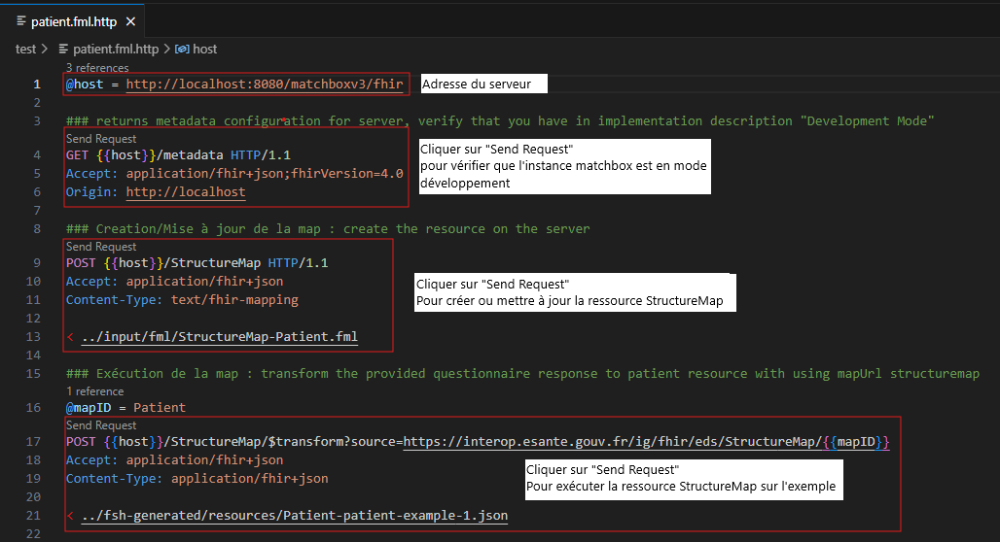

# Guide d'implémentation FHIR du GT Standards et Interopérabilité

Ce guide peut être visible à l'adresse suivante : https://ansforge.github.io/IG-FHIR-EDS-SOCLE-COMMUN.

## Contexte

Le groupe de travail “standards et interopérabilité” lancé en janvier 2024 s’inscrit dans la continuité du précédent groupe de travail ayant abouti à la constitution d’un socle commun de données de santé entre Entrepôts de Données de Santé Hospitaliers.

En effet, la seconde étape pour permettre l’interopérabilité entre les EDSH est de définir un standard commun pour ces données du socle.

Pour proposer une standardisation des données du socle, les membres du GT ont fait le choix du modèle OMOP, avec la création d'un guide d'implémentation FHIR.

Cette proposition s’appuie dans un premier temps sur la réponse qu’apporte OMOP aux familles d’usage du GT (i.e., les typologies de données définies dans le socle telles que biologie, médicament, PMSI, etc.).

Dans un second temps, la ressource OMOP s’érige également comme étant le modèle le mieux connu et maîtrisé par les membres du GT, qui représentent également un large panel de professionnels de santé (médecins, médecins DIM, data ingénieurs, etc.). Ainsi, il a semblé judicieux de proposer des spécifications applicables à un grand nombre d'établissements de santé, ayant les ressources en interne pour mettre en place et maintenir cette standardisation.

Néanmoins, ce standard présente une structure figée et spécifique et est peu évolutif, ce qui dresse ses limites face aux possibilités qu’offre le standard FHIR. Aussi, un sous-groupe dédié à des spécifications en FHIR a été lancé en parallèle des travaux en OMOP.

L’objectif de ce sous-groupe est la création d'un guide d'implémentation FHIR pour quelques variables du socle, afin de proposer une méthode et une démarche à suivre.

## Construction du guide

### Installation de l'environnement de construction du guide

#### Git

Avoir un client Git installé sur son poste.

#### Java

Avoir une Java machine virtuelle installée sur son poste (de préférence une version LTS).

#### Jekyll

Les informations sur l'installation de jekyll se trouve : [https://jekyllrb.com/docs/installation](https://jekyllrb.com/docs/installation).

### Tâches Gradle principales

Si vous utilisez un environnement de développement tel que VSCode, Eclipse ou IntellIJ, celui-ci aura identifié que ce projet est un projet géré à l'aide de gradle.

Si vous n'utilisez pas un environnement de développement, alors je suis bien ennuyé...

Le fichier gradle.properties contient les numéros de version d'outils participant à la construction d'un guide d'implémentation.

Dans le script gradle se trouve de nombreuses tâches dont les plus importantes à connaître sont :

* buildIG : permettant de constuire le guide d'implémentation. Le premier lancement est plus long car il y a une étape de récupération de l'outil IG Publisher dans la version spécifiée dans le fichier de configuration gradle (gradle.properties) et la création de fichiers de cache.
* reBuildIG : supprime les répertoires créés lors d'une construction puis lance la construction. Il n'est pas nécessaire de faire appel à cette tâche systèmatiquement (cf. la description de la tâche buildIG). Cette tâche très utile lors d'un changement de version de l'IG Publisher.
* sushiBuild : lance seuelement l'outil sushi (partique dans un contexte de cycle court de définition de fichiers FSH).

## Execution des ressources StructureMap

Les ressources StructureMap écrit à l'aide du FML peuvent être executés afin de vérifier que les attendus du processus de transformation soient conforme aux spécifications.

### Mise en oeuvre de l'environnement d'execution des fichiers FML

#### Mise en oeuvre du moteur d'execution du FML

Il existe de nombreuses solutions permettant l'execution d'un fichier FML. Nous nous proposons de décrire l'installation et l'utilisation de la solution [Matchbox](https://github.com/ahdis/matchbox).

Par la suite, nous considerons que les notions relatives à l'utilisation de l'outil `git` sont connues du lecteur. La première étape que nous recommandons est de créer un fork du projet [Matchbox](https://github.com/ahdis/matchbox) et de se positionner sur le commit de la dernière release. La gestion des dépendances de ce projet est réalisée par maven, nous précisons cela car ce projet est multimodule et va nécéssiter de modifier deux sous-modules. Comme précisé précédement ce projet est composé de trois sous-module :

1. matchbox-engine
2. matchbox-frontend
3. matchbox-server

Dans le sous-module matchbox-engine, nous devons ajouter dans le répertoire `src/main/resources` les packages de ce guide d'implémentation et de toutes ses dépendances, y compris le packages du standard FHIR.

Puis dans le sous-module matchbox-server, nous devons ajouter ces packages dans le fichier `src/main/resources/application.yml` à la section `hapi.fhir.implementationguides`. Aussi dans la section `matchbox.fhir.context.onlyOneEngine` fixer à `true`.

Une fois ces deux étapes de spécialisation au contexte du contenu de ce guide d'implémentation, nous devons constuire le projet, puis l'image Docker et enfin créer le conteneur. Comme pour l'utilisation de l'outil git, nous considérons que le lecteur est au fait de l'installation et de l'utilisation de `maven` et de `docker`.

La construction du projet peut se faire à l'aide de maven et plus précisement à l'aide de la commande suivante : `mvn clean package -DskipTests`. Une fois cette étape réalisée, nous devons lancer la création de l'image Docker. Dans le sous-module matchbox-server, lancer la commande : `docker build -t matchbox .` pour construire l'image. Enfin toujours dans le sous-module matchbox-server, se positionner dans le répertoire with-postgres pour lancer la commande `docker-compose up -d` pour créer et executer l'image précédement construite associée à une base de donnée PostgreSQL.

#### Installation du Client REST VSCode

Nous vous recommandons l'installation de l'extension [humao.rest-client](https://github.com/Huachao/vscode-restclient) pour VSCode.

### Execution des tests

Dans le répertoire test du projet, se trouve des fichiers avec l'extension *.http. Ce sont des fichiers permettant de créer une ressource StructureMap à partir d'un fichier FML et de lancer son execution.

Ces fichiers *.http se décompose en trois parties : 

1. Permet de vérfier que l'instance de matchbox est bien en "Development Mode" ;
2. Permet de créer/mettre à jour la ressource StructureMap à partir d'un fichier FML ; 
3. Permet l'execution d'une ressource StructureMap sur un exemple fourni en argument.

## Acronymes

* IG : Implementation Guide
* FHIR : Fast Healthcare Interoperability Resources
* HL7 : Health Level Seven
* FML : FHIR Mapping Language